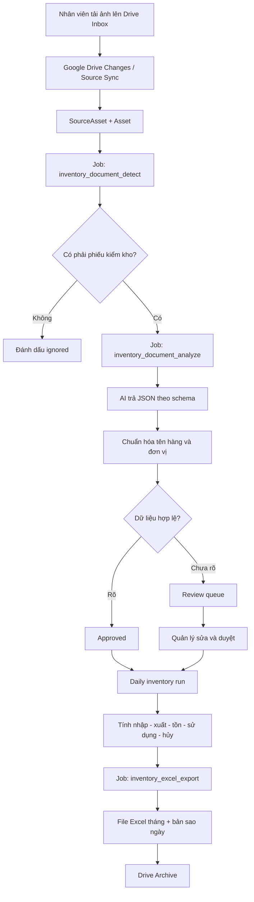

# Tài liệu tích hợp quy trình kiểm kho tự động từ Google Drive

## 1. Mục đích

Tài liệu này mô tả cách tích hợp quy trình kiểm kho tự động vào source code `creative-asset-manager`, branch `feature/google-drive-explorer-mvp`.

Mục tiêu vận hành:

1. Nhân viên chụp phiếu kiểm kho và tải ảnh vào một thư mục Google Drive cố định.
2. Hệ thống tự kiểm tra file mới trong ngày.
3. Hệ thống chống xử lý trùng và lưu dấu vết ảnh nguồn.
4. AI đọc phiếu, chữ viết tay, số lượng nguyên/lẻ, hàng hủy và lý do hủy.
5. Hệ thống đối chiếu tên hàng với danh mục chuẩn.
6. Dòng rõ được duyệt tự động; dòng không chắc chắn chuyển sang hàng chờ xác nhận.
7. Đúng giờ chốt, hệ thống tính nhập – xuất – tồn – sử dụng – hủy.
8. Hệ thống tạo báo cáo ngày, cập nhật file Excel tháng và giữ nguyên sheet 4.
9. Toàn bộ dữ liệu, thao tác sửa và file xuất đều có lịch sử kiểm tra.

Tài liệu ưu tiên tái sử dụng kiến trúc hiện có thay vì tạo một ứng dụng riêng.

---

## 2. Hiện trạng source code có thể tái sử dụng

Source hiện tại đã có các nền tảng phù hợp:

- FastAPI API tại `apps/api/app/main.py`.
- OAuth Google Drive và token refresh server-side.
- Google Drive client hỗ trợ đọc, tải lên, di chuyển, sao chép và stream file.
- `ExternalSourceModel`, `SourceAssetModel`, `AssetModel` và liên kết nguồn – asset.
- Đồng bộ Google Drive toàn phần hoặc incremental qua module `source_sync`.
- `SourceSyncScheduler` tạo job đồng bộ định kỳ.
- Hàng đợi bền vững `processing_jobs`, có lease, retry, idempotency và trạng thái lỗi.
- Worker có cơ chế đăng ký handler theo `job_type`.
- AI metadata pipeline hỗ trợ ảnh, kiểm tra kích thước, JSON schema, rate limit và budget governance.
- PostgreSQL/SQLAlchemy/Alembic cho dữ liệu production.
- React/Vite client có thể mở rộng thêm màn hình kiểm kho.

Do đó, giải pháp mới nên được xây như một domain module `inventory`, chạy trên pipeline hiện có:

```text
Google Drive source sync
    -> source asset download / content dedup
    -> inventory document detection
    -> inventory AI analysis
    -> normalization and validation
    -> review or approval
    -> daily finalization
    -> Excel export and archive
```

---

## 3. Kiến trúc mục tiêu



### Nguyên tắc kiến trúc

- PostgreSQL là nguồn dữ liệu chuẩn; không dùng Excel làm database.
- Google Drive là nơi nhận ảnh và lưu file xuất.
- Mọi bước nặng chạy qua `processing_jobs`, không chạy trong request HTTP.
- Mỗi bước phải idempotent để chạy lại không tạo dữ liệu trùng.
- Không tự suy đoán dữ liệu không rõ.
- Không sửa trực tiếp sheet 4.
- Chỉ chốt ngày khi đã đủ ảnh hoặc quản lý chủ động xác nhận chốt thiếu.

---

## 4. Cấu trúc Google Drive

Tạo một thư mục gốc, ví dụ `KIEM_KHO_TU_DONG`:

```text
KIEM_KHO_TU_DONG/
├── 00_INBOX_NHAN_VIEN/
├── 01_DA_XU_LY/
│   └── YYYY-MM-DD/
├── 02_CAN_CHUP_LAI/
│   └── YYYY-MM-DD/
├── 03_FILE_EXCEL_CHINH/
├── 04_BAN_SAO_HANG_NGAY/
└── 05_LUU_TRU_ANH_CU/
```

Nhân viên chỉ cần quyền tải file vào `00_INBOX_NHAN_VIEN`.

### Quy tắc phiếu

Tiêu đề từng mẫu phải được in rõ:

- `PHIẾU KIỂM KHO – PHÒNG PHA CHẾ`
- `PHIẾU KIỂM KHO – KHO PHÒNG RANG`
- `PHIẾU XUẤT KHO PHA CHẾ`

Phiếu nhiều trang phải có `Trang X/Y`. Mỗi phiếu nên có ngày kiểm, khu vực và người thực hiện.

### Quy tắc xác định ngày nghiệp vụ

Ưu tiên theo thứ tự:

1. Ngày đọc được trên phiếu.
2. Ngày nhân viên tải file lên Drive theo múi giờ `Asia/Ho_Chi_Minh`.
3. Quản lý chọn lại ngày trong hàng chờ xác nhận.

Hệ thống phải xử lý **mọi file chưa từng xử lý**, không chỉ truy vấn cứng “file hôm nay”. Cách này tránh bỏ sót ảnh tải muộn hoặc job bị trì hoãn.

---

## 5. Phạm vi thay đổi source code

### 5.1. Module mới

Tạo thư mục:

```text
apps/api/app/modules/inventory/
├── model.py
├── schema.py
├── repository.py
├── service.py
├── router.py
├── permissions.py
├── document_classifier.py
├── extraction_schema.py
├── normalization.py
├── validation.py
├── transaction_service.py
├── daily_run_service.py
├── report_service.py
├── excel_export_service.py
├── drive_archive_service.py
├── job_handlers.py
└── scheduler.py
```

Tách trách nhiệm:

- `document_classifier.py`: xác định ảnh có phải phiếu kiểm kho và loại phiếu.
- `extraction_schema.py`: JSON schema gửi cho AI.
- `normalization.py`: alias, mã hàng, đơn vị và quy đổi.
- `validation.py`: kiểm tra logic và bất thường.
- `transaction_service.py`: tạo giao dịch nhập, xuất, hủy, tồn.
- `daily_run_service.py`: gom dữ liệu theo ngày/khu vực và chốt ngày.
- `excel_export_service.py`: cập nhật file Excel tháng.
- `drive_archive_service.py`: chuyển ảnh vào `ĐÃ XỬ LÝ` hoặc `CẦN CHỤP LẠI`.
- `job_handlers.py`: nối các job inventory vào worker hiện có.
- `scheduler.py`: lịch kiểm tra thiếu ảnh, chốt ngày và xuất báo cáo.

### 5.2. File cần sửa

#### `apps/api/app/main.py`

- Import `inventory.router`.
- `include_router` cho các endpoint kiểm kho.
- Không chạy xử lý AI trong API lifecycle.

#### `apps/api/app/core/config.py`

Thêm cấu hình inventory và validator tương ứng.

#### `.env.example`

Bổ sung biến môi trường mô tả tại mục 14.

#### Worker entrypoint hiện có

- Đăng ký các `job_type` mới.
- Khởi động `SourceSyncScheduler` và `InventoryScheduler` trong process worker/scheduler, không khởi động nhiều bản trong mỗi API replica.

#### Google Drive source registration

Mở rộng `ExternalSourceModel.source_metadata` hoặc tạo binding riêng để lưu:

- Folder Inbox ID.
- Folder Processed ID.
- Folder Reupload ID.
- Folder Excel ID.
- Folder Backup ID.
- Timezone.

Không hard-code Folder ID trong source.

#### `apps/api/requirements.txt`

Thêm thư viện xuất Excel:

```text
openpyxl
```

Nếu file có macro `.xlsm`, dùng `keep_vba=True`; nếu chỉ `.xlsx`, dùng chế độ thông thường.

#### Alembic

Migration nằm tại `database/migrations/versions/` theo cấu hình hiện tại.

---

## 6. Mô hình dữ liệu đề xuất

### 6.1. `inventory_locations`

Danh sách khu vực kho.

| Field | Ý nghĩa |
|---|---|
| `id` | UUID |
| `tenant_id` | Tenant |
| `code` | `KHO_PHA_CHE`, `PHONG_PHA_CHE`, `KHO_PHONG_RANG` |
| `name` | Tên hiển thị |
| `active` | Đang sử dụng |

Unique: `tenant_id + code`.

### 6.2. `inventory_folder_bindings`

| Field | Ý nghĩa |
|---|---|
| `external_source_id` | Google Drive source |
| `inbox_folder_id` | Thư mục nhân viên tải ảnh |
| `processed_folder_id` | Ảnh đã xử lý |
| `reupload_folder_id` | Ảnh cần chụp lại |
| `excel_folder_id` | File Excel chính |
| `backup_folder_id` | Bản sao hằng ngày |
| `timezone` | `Asia/Ho_Chi_Minh` |

### 6.3. `inventory_documents`

Một phiếu kiểm kho logic, có thể gồm nhiều ảnh.

| Field | Ý nghĩa |
|---|---|
| `id` | UUID |
| `tenant_id` | Tenant |
| `business_date` | Ngày kiểm kho |
| `document_type` | `stock_count`, `warehouse_transfer`, `waste` |
| `location_code` | Khu vực |
| `status` | Trạng thái |
| `expected_pages` | Tổng số trang |
| `received_pages` | Số trang đã nhận |
| `submitted_by` | Người ghi trên phiếu nếu đọc được |
| `approved_by` | Người duyệt |
| `approved_at` | Thời điểm duyệt |

Trạng thái:

```text
collecting
analyzing
needs_review
approved
rejected
finalized
```

### 6.4. `inventory_document_pages`

Liên kết ảnh nguồn với document.

- `document_id`
- `source_asset_id`
- `asset_id`
- `drive_file_id`
- `page_number`
- `page_count`
- `content_hash`
- `ai_status`
- `raw_extraction_json`

Unique theo `tenant_id + content_hash` để chống tải trùng nội dung.

### 6.5. `inventory_item_master`

Danh mục hàng chuẩn:

- Mã hàng.
- Tên chuẩn.
- Đơn vị nguyên.
- Đơn vị lẻ.
- Hệ số quy đổi.
- Nhóm hàng.
- Trạng thái.

### 6.6. `inventory_item_aliases`

Ví dụ:

```text
TC OLONG -> TRÂN CHÂU OLONG
RICHS (LÙN) -> RICH LÙN
BỘT Đ.XAY -> BỘT BÉO ĐÁ XAY
```

Unique: `tenant_id + normalized_alias`.

### 6.7. `inventory_lines`

Kết quả từng dòng trên phiếu:

- `document_id`
- `line_number`
- `raw_item_name`
- `item_id`
- `whole_quantity`
- `fraction_quantity`
- `whole_unit`
- `fraction_unit`
- `waste_quantity`
- `waste_reason`
- `confidence`
- `validation_status`
- `review_note`

### 6.8. `inventory_transactions`

Sổ giao dịch chuẩn:

- `business_date`
- `location_id`
- `item_id`
- `transaction_type`
- `quantity_base_unit`
- `source_document_id`
- `source_line_id`
- `status`

Loại giao dịch:

```text
opening_balance
receipt
transfer_out
transfer_in
closing_count
waste
usage_adjustment
```

### 6.9. `inventory_daily_runs`

Một bản ghi cho mỗi ngày/tenant:

- Tình trạng ảnh từng khu vực.
- Thời điểm chốt.
- Người chốt.
- Có chốt thiếu hay không.
- Phiên bản báo cáo.
- File Excel xuất ra.

### 6.10. `inventory_review_items`

Hàng chờ xác nhận:

- Loại lỗi.
- Ảnh/crop tham chiếu.
- Giá trị AI đề xuất.
- Giá trị cuối.
- Người sửa.
- Lịch sử sửa.

### 6.11. `inventory_exports`

Lưu lịch sử file Excel:

- Tháng.
- Ngày chốt.
- Drive file ID.
- Hash file.
- Trạng thái.
- Lỗi nếu có.

---

## 7. Job pipeline

Sử dụng `processing_jobs` hiện có.

### 7.1. Job mới

```text
inventory_document_detect
inventory_document_group
inventory_document_analyze
inventory_document_normalize
inventory_document_validate
inventory_document_archive
inventory_daily_finalize
inventory_excel_export
inventory_daily_report
```

### 7.2. Idempotency key

Ví dụ:

```text
inventory-detect:{asset_id}:{content_hash}
inventory-analyze:{document_page_id}:{analysis_profile_version}
inventory-finalize:{tenant_id}:{business_date}:{run_version}
inventory-export:{tenant_id}:{yyyy_mm}:{business_date}:{run_version}
```

### 7.3. Retry

- Lỗi mạng/429/5xx: retry với backoff.
- JSON AI sai schema: thử lại tối đa theo `AI_ANALYSIS_MAX_VALIDATION_ATTEMPTS`.
- Ảnh không đọc được: không retry vô hạn; chuyển `needs_review` hoặc `needs_reupload`.
- File Excel đang bị khóa: retry sau; dữ liệu vẫn giữ trong DB.

### 7.4. Kết nối pipeline hiện hữu

Khi source sync phát hiện file ảnh mới trong Inbox:

1. Tạo/cập nhật `SourceAssetModel`.
2. Tạo job tải nội dung theo pipeline hiện tại.
3. Sau khi có `AssetModel` và managed storage, tạo `inventory_document_detect`.
4. Chỉ các asset thuộc Folder Inbox binding mới đi vào inventory pipeline.
5. File ngoài Inbox tiếp tục được xử lý như creative asset bình thường.

Không thay đổi hành vi chung của Explorer.

---

## 8. Đồng bộ Google Drive

### 8.1. Kết nối

Admin dùng luồng `/api/auth/google/connect-drive`. Production phải bật persistent auth và mã hóa token.

### 8.2. Folder scope

Tạo `inventory_folder_bindings` sau khi admin chọn folder trên Explorer.

Endpoint đề xuất:

```text
POST /api/inventory/settings/folders
GET  /api/inventory/settings/folders
POST /api/inventory/settings/test-drive
```

### 8.3. Polling

Tái sử dụng `SourceSyncScheduler`:

```text
SOURCE_SYNC_POLL_INTERVAL_SECONDS=300
```

Mỗi 5 phút là đủ cho quy trình kiểm kho.

### 8.4. Lọc file

Chỉ nhận:

- MIME type bắt đầu bằng `image/`.
- File thuộc Inbox hoặc descendant của Inbox.
- File chưa bị xóa.
- File chưa có content hash đã xử lý.

### 8.5. Di chuyển file

Sau khi hoàn tất:

- `approved/finalized` -> `01_DA_XU_LY/YYYY-MM-DD`.
- `needs_reupload` -> `02_CAN_CHUP_LAI/YYYY-MM-DD`.
- `needs_review` vẫn giữ trong Inbox hoặc chuyển theo policy cấu hình.

Mọi thao tác move phải dùng Drive file ID, không dựa vào tên file.

---

## 9. AI extraction profile

Không dùng metadata profile chung của creative asset cho phiếu kiểm kho. Tạo profile riêng:

```text
profile_name: inventory_stock_sheet_v1
```

### 9.1. JSON đầu ra

```json
{
  "document_type": "stock_count",
  "business_date": "2026-08-06",
  "location_code": "PHONG_PHA_CHE",
  "page_number": 1,
  "page_count": 2,
  "employee_name": null,
  "rows": [
    {
      "line_number": 1,
      "raw_item_name": "TC OLONG",
      "whole_quantity": 1,
      "whole_unit": "gói",
      "fraction_quantity": 250,
      "fraction_unit": "gram",
      "waste_quantity": 0,
      "waste_unit": null,
      "waste_reason": null,
      "confidence": 0.97,
      "notes": null
    }
  ],
  "warnings": []
}
```

### 9.2. Prompt rules

- Chỉ đọc nội dung nhìn thấy.
- Không tự đoán số bị che hoặc mờ.
- Giữ `raw_item_name` đúng như ảnh.
- Tách số nguyên và số lẻ.
- Đọc mọi ghi chú viết tay ngoài bảng.
- Nếu có sửa số, ưu tiên số mới khi dấu gạch sửa rõ ràng; nếu không chắc, cảnh báo.
- Hàng hủy phải có số lượng và lý do; thiếu lý do phải cảnh báo.
- Trả JSON đúng schema, không thêm văn bản ngoài JSON.

### 9.3. Chọn provider

Source đã hỗ trợ Gemini và OpenAI. Inventory profile nên dùng provider được tenant policy cho phép, có budget limit và emergency stop.

Không hard-code model trong service; lấy từ processing policy/config.

---

## 10. Chuẩn hóa và kiểm tra dữ liệu

### 10.1. Chuẩn hóa tên

Thứ tự:

1. Mã hàng chính xác.
2. Tên chuẩn chính xác sau normalize.
3. Alias chính xác.
4. Ghép gần đúng trong ngưỡng an toàn.
5. Chuyển review nếu còn nhiều hơn một ứng viên.

### 10.2. Chuẩn hóa đơn vị

Mọi số lượng được quy đổi về đơn vị cơ sở, ví dụ gram/ml/cái.

Lưu cả:

- Giá trị gốc trên phiếu.
- Giá trị sau quy đổi.
- Hệ số quy đổi đã dùng.

Không được thay đổi lịch sử khi hệ số quy đổi của danh mục thay đổi về sau.

### 10.3. Validation rules

- Số lượng không âm.
- Đơn vị phải thuộc danh mục cho mặt hàng.
- Phiếu phải đủ trang.
- Không trùng content hash.
- Không trùng document/page.
- Tồn cuối tăng bất thường phải cảnh báo.
- Sử dụng âm phải cảnh báo, không tự ép về 0.
- Hủy có số lượng nhưng thiếu lý do -> review.
- Chuyển kho phải tạo đồng thời `transfer_out` và `transfer_in` cùng mã chứng từ.

### 10.4. Ngưỡng duyệt

Gợi ý ban đầu:

- Confidence >= 0.95 và qua toàn bộ validation: tự duyệt.
- 0.80–0.949: review.
- < 0.80 hoặc ảnh không đọc được: cần chụp lại/review.

Ngưỡng phải cấu hình theo tenant, không viết cứng.

---

## 11. Tính toán nghiệp vụ

Công thức:

```text
Sử dụng = Tồn đầu + Nhập + Chuyển vào - Chuyển ra - Tồn cuối - Hủy
```

Trong trường hợp hệ thống hiện tại chỉ ghi `Nhập` tổng hợp, có thể biểu diễn:

```text
Sử dụng = Tồn đầu + Nhập - Tồn cuối - Hủy
```

Nhưng database vẫn nên lưu riêng chuyển vào/chuyển ra để audit.

### Chuyển Kho pha chế -> Phòng pha chế

Một dòng phiếu xuất tạo hai transaction trong cùng transaction database:

```text
KHO_PHA_CHE   -> transfer_out
PHONG_PHA_CHE -> transfer_in
```

Nếu một bên tạo lỗi thì rollback cả hai.

---

## 12. API đề xuất

### Cấu hình

```text
GET  /api/inventory/settings
PUT  /api/inventory/settings
POST /api/inventory/settings/folders
POST /api/inventory/settings/test-drive
```

### Ngày vận hành

```text
GET  /api/inventory/daily-runs?date=YYYY-MM-DD
POST /api/inventory/daily-runs/{date}/scan
POST /api/inventory/daily-runs/{date}/finalize
POST /api/inventory/daily-runs/{date}/reopen
GET  /api/inventory/daily-runs/{date}/report
```

### Documents

```text
GET  /api/inventory/documents
GET  /api/inventory/documents/{id}
POST /api/inventory/documents/{id}/reanalyze
POST /api/inventory/documents/{id}/approve
POST /api/inventory/documents/{id}/reject
```

### Review

```text
GET   /api/inventory/reviews
PATCH /api/inventory/reviews/{id}
POST  /api/inventory/reviews/{id}/approve
POST  /api/inventory/reviews/{id}/request-reupload
```

### Danh mục

```text
GET/POST/PATCH /api/inventory/items
GET/POST/DELETE /api/inventory/item-aliases
```

### Export

```text
POST /api/inventory/exports/daily
POST /api/inventory/exports/monthly
GET  /api/inventory/exports
```

Tất cả mutation endpoint phải có permission riêng và audit actor.

---

## 13. Giao diện React

Mở rộng client bằng các màn hình:

### `InventoryTodayPage`

- Trạng thái Phòng pha chế.
- Trạng thái Kho phòng rang.
- Phiếu xuất kho.
- Số ảnh nhận được.
- Số dòng cần duyệt.
- Thời gian quét gần nhất.
- Nút quét lại và chốt ngày.

### `InventoryReviewPage`

Hiển thị:

- Ảnh gốc hoặc crop dòng.
- Kết quả AI.
- Tên hàng đề xuất.
- Số lượng/đơn vị.
- Cảnh báo.
- Nút sửa, duyệt, yêu cầu chụp lại.

### `InventoryItemsPage`

- Danh mục hàng.
- Alias.
- Đơn vị và hệ số quy đổi.

### `InventoryReportsPage`

- Theo ngày/tuần/tháng.
- Sử dụng.
- Hủy và lý do.
- Bất thường.
- Link file Excel và bản sao.

### Quyền

- `inventory.view`
- `inventory.review`
- `inventory.manage_items`
- `inventory.finalize`
- `inventory.export`
- `inventory.configure`

---

## 14. Biến môi trường

Bổ sung vào `.env.example`:

```dotenv
# Inventory automation
INVENTORY_AUTOMATION_ENABLED=false
INVENTORY_TIMEZONE=Asia/Ho_Chi_Minh
INVENTORY_SCAN_INTERVAL_SECONDS=300
INVENTORY_INBOX_FOLDER_ID=
INVENTORY_PROCESSED_FOLDER_ID=
INVENTORY_REUPLOAD_FOLDER_ID=
INVENTORY_EXCEL_FOLDER_ID=
INVENTORY_BACKUP_FOLDER_ID=
INVENTORY_EXCEL_TEMPLATE_FILE_ID=
INVENTORY_DAILY_REMINDER_TIME=14:00
INVENTORY_MISSING_CHECK_TIME=16:30
INVENTORY_FINAL_SCAN_TIME=16:50
INVENTORY_FINALIZE_TIME=17:00
INVENTORY_EXPORT_TIME=17:10
INVENTORY_AUTO_APPROVE_CONFIDENCE=0.95
INVENTORY_REVIEW_CONFIDENCE=0.80
INVENTORY_MAX_FILES_PER_SCAN=25
INVENTORY_MAX_FILE_BYTES=10000000
INVENTORY_EXCEL_EXPORT_ENABLED=false
INVENTORY_DRIVE_ARCHIVE_ENABLED=false
```

Production nên lưu Folder ID trong database theo tenant. Env chỉ nên là fallback cho một tenant hoặc local development.

Feature flags phụ thuộc:

```dotenv
PERSISTENT_AUTH_ENABLED=true
PROCESSING_JOBS_ENABLED=true
INCREMENTAL_SOURCE_SYNC_ENABLED=true
SOURCE_SYNC_SCHEDULER_ENABLED=true
MANAGED_ASSET_STORAGE_ENABLED=true
DYNAMIC_AI_METADATA_ENABLED=true
AI_SINGLE_ANALYSIS_ENABLED=true
AI_AUTO_ANALYZE_ENABLED=true
```

Bật từng flag theo rollout, không bật đồng loạt ngay ngày đầu.

---

## 15. Lịch vận hành

### 14:00

- Hệ thống hiển thị/ gửi nhắc kiểm kho qua kênh thông báo được cấu hình.
- Nhân viên tải ảnh vào Folder Inbox.

### 14:00–16:45

- Source sync quét mỗi 5 phút.
- Worker tải ảnh và xử lý AI.
- UI cập nhật tình trạng gần thời gian thực.

### 16:30

- Kiểm tra thiếu khu vực/trang.
- Tạo cảnh báo trong hệ thống.

### 16:50

- Quét lần cuối trước chốt.
- Đánh dấu document còn thiếu trang.

### 17:00

- Nếu đủ dữ liệu và không có lỗi bắt buộc: chốt tự động.
- Nếu còn review: giữ trạng thái `awaiting_review` hoặc chốt phần đã duyệt theo policy.
- Không được âm thầm bỏ dòng lỗi.

### 17:10

- Xuất Excel.
- Upload file tháng và bản sao ngày.
- Di chuyển ảnh đã hoàn tất.
- Ghi báo cáo ngày.

---

## 16. Xuất Excel và giữ nguyên sheet 4

### Nguyên tắc

- File template là nguồn định dạng.
- Database là nguồn số liệu.
- Tải file tháng hiện tại từ `03_FILE_EXCEL_CHINH`.
- Khóa export theo `tenant + month` để tránh hai worker cùng ghi.
- Tạo bản sao tạm.
- Chỉ cập nhật các sheet được allowlist.
- Không đọc/ghi cell của sheet 4.
- Validate workbook sau khi lưu.
- Upload phiên bản mới và bản sao ngày.

### Allowlist sheet

Ví dụ:

```python
ALLOWED_SHEETS = {
    "KHO PHA CHẾ",
    "PHÒNG PHA CHẾ",
    "KHO PHÒNG RANG",
    "NHẬT KÝ HẰNG NGÀY",
    "BÁO CÁO NGẮN",
    "DANH MỤC HÀNG",
}
PROTECTED_SHEETS = {"Báo cáo sử dụng NVL trong ca"}
```

Tên sheet thật phải lấy từ workbook hiện tại và cấu hình, không giả định cố định trong code.

### Chống mất file

1. Tải template/bản hiện tại.
2. Tính hash trước sửa.
3. Ghi vào file tạm.
4. Mở lại file tạm để kiểm tra.
5. Upload bản backup trước.
6. Sau đó cập nhật file chính.
7. Ghi Drive file ID/hash vào `inventory_exports`.

Nếu export lỗi, ngày vẫn chốt trong database và có thể chạy lại export.

---

## 17. Bảo mật

- Google OAuth token chỉ lưu server-side và được mã hóa.
- Không để access token trong client hoặc log.
- Folder Inbox không chia sẻ công khai toàn Internet.
- Dùng group/Google account nhân viên khi có thể.
- Chỉ admin được cấu hình Folder ID và template Excel.
- Mọi sửa số liệu phải ghi actor, thời gian, giá trị trước/sau.
- AI raw response mặc định không lưu lâu; tuân theo retention config.
- Ảnh kiểm kho có thời hạn lưu rõ ràng, ví dụ 12 tháng.
- Không thu thập giấy tờ cá nhân trong ảnh.
- Production dùng PostgreSQL, HTTPS, trusted hosts và secure cookies.

---

## 18. Monitoring và xử lý lỗi

Metric/log cần có:

- `inventory_files_discovered`
- `inventory_files_duplicate`
- `inventory_documents_analyzed`
- `inventory_documents_needs_review`
- `inventory_documents_needs_reupload`
- `inventory_lines_auto_approved`
- `inventory_lines_corrected`
- `inventory_daily_finalize_success`
- `inventory_excel_export_success`
- `inventory_excel_export_failed`
- Thời gian từ upload đến hoàn thành.
- Chi phí AI theo ngày/tenant.

Health/readiness:

- Readiness không cần gọi Google/AI ở mọi request.
- Thêm endpoint admin kiểm tra Drive, AI và Excel template theo yêu cầu.

Dead-letter:

- Job vượt `max_attempts` chuyển failed.
- UI phải có danh sách job lỗi và nút retry có permission.

---

## 19. Kiểm thử

### Unit tests

- Normalize tên và alias.
- Quy đổi đơn vị.
- Công thức sử dụng.
- Tạo cặp transfer in/out.
- Confidence thresholds.
- Idempotency key.
- Không cho phép sửa sheet 4.

### Integration tests

- Drive change -> source asset -> inventory job.
- Upload trùng nội dung.
- Ảnh nhiều trang.
- AI JSON sai schema.
- Token hết hạn và refresh.
- Worker chết giữa job và lease recovery.
- Export lỗi rồi chạy lại.

### Fixture ảnh

Cần bộ ảnh có:

- Ảnh thẳng, nghiêng, ngược.
- Sáng/tối.
- Chữ viết tay rõ/mờ.
- Sửa số.
- Thiếu trang.
- Hàng hủy có/không có lý do.
- Tên viết tắt.

### End-to-end acceptance

```text
Nhân viên upload ảnh
-> hệ thống phát hiện trong <= 5 phút
-> không xử lý trùng
-> dữ liệu xuất hiện trong UI
-> dòng rõ được duyệt
-> dòng mờ vào review
-> chốt ngày đúng công thức
-> file Excel được tạo
-> sheet 4 không thay đổi
-> ảnh được archive đúng folder
```

So sánh hash/serialized cells của sheet 4 trước và sau export để nghiệm thu.

---

## 20. Kế hoạch triển khai

### Giai đoạn 1 – Drive Inbox và phát hiện file

- Tạo folder binding.
- Bật persistent auth.
- Bật source sync scheduler.
- Chỉ phát hiện ảnh mới và ghi log.
- Chưa gọi AI, chưa di chuyển file.

Tiêu chí: không bỏ sót và không tạo trùng.

### Giai đoạn 2 – AI extraction

- Tạo profile/schema inventory.
- Phân loại phiếu.
- Lưu extraction JSON.
- Xây review queue.

Tiêu chí: đọc đúng bộ ảnh thử và không tự đoán dữ liệu mờ.

### Giai đoạn 3 – Danh mục và nghiệp vụ

- Import danh mục hàng.
- Import alias.
- Quy đổi đơn vị.
- Tạo transaction.
- Tính sử dụng/hủy.

Tiêu chí: đối chiếu thủ công với ít nhất một tuần dữ liệu.

### Giai đoạn 4 – UI quản lý

- Tổng quan hôm nay.
- Review.
- Danh mục.
- Báo cáo.

### Giai đoạn 5 – Excel export

- Dùng bản sao template.
- Kiểm tra sheet 4.
- Chạy shadow mode: tạo file nhưng chưa thay file chính.

### Giai đoạn 6 – Chạy song song

Trong 7–14 ngày:

- Quy trình cũ vẫn chạy.
- Hệ thống mới tự xử lý.
- So sánh từng ngày.
- Ghi tỷ lệ đúng và nguyên nhân sai.

### Giai đoạn 7 – Production

- Bật finalize/export chính thức.
- Đóng quyền sửa trực tiếp dữ liệu nguồn ngoài quy trình.
- Thiết lập backup và retention.
- Có người chịu trách nhiệm review mỗi ngày.

---

## 21. Quy trình vận hành hằng ngày

### Nhân viên

1. Ghi đủ số lượng.
2. Ghi hàng hủy và lý do.
3. Chụp rõ đủ trang.
4. Tải tất cả ảnh vào Folder Inbox.
5. Chờ tải lên hoàn tất.

### Hệ thống

1. Quét Drive.
2. Phát hiện file mới.
3. Chống trùng.
4. Tải và lưu asset.
5. Phân loại phiếu.
6. Phân tích AI.
7. Chuẩn hóa và validate.
8. Tự duyệt hoặc tạo review.
9. Kiểm tra đủ khu vực.
10. Chốt ngày.
11. Xuất Excel.
12. Archive ảnh.

### Quản lý

1. Mở `Inventory Today` trước 17:00.
2. Xử lý các dòng cần review.
3. Yêu cầu chụp lại khi cần.
4. Xác nhận chốt thiếu nếu có lý do.
5. Kiểm tra báo cáo và link file Excel.

---

## 22. Quy trình đầu tháng

1. Chốt ngày cuối tháng trước.
2. Xác nhận tồn cuối.
3. Tạo file Excel tháng mới từ template.
4. Chuyển tồn cuối thành tồn đầu.
5. Khóa file tháng cũ ở chế độ chỉ đọc.
6. Cập nhật `INVENTORY_EXCEL_TEMPLATE_FILE_ID` hoặc bản ghi export tháng.
7. Chạy test export không dữ liệu trước ngày đầu tiên.

---

## 23. Tiêu chí hoàn thành

- [ ] Drive OAuth production hoạt động và refresh token bền vững.
- [ ] Admin chọn được Folder Inbox và các folder đích.
- [ ] File mới được phát hiện trong thời gian cấu hình.
- [ ] Không xử lý trùng cùng một nội dung.
- [ ] Phiếu được phân loại đúng khu vực.
- [ ] Ghép được phiếu nhiều trang.
- [ ] AI trả JSON hợp lệ.
- [ ] Alias và đơn vị hoạt động đúng.
- [ ] Dòng mờ không được tự duyệt.
- [ ] Transfer tạo đủ hai phía.
- [ ] Báo cáo ngày đúng công thức.
- [ ] Excel tháng được cập nhật.
- [ ] Sheet 4 giữ nguyên.
- [ ] Có backup ngày và audit log.
- [ ] Có thể retry job và export.
- [ ] Có dashboard theo dõi lỗi và review.

---

## 24. Thứ tự backlog đề xuất

1. Migration cho inventory tables.
2. Inventory folder binding API/UI.
3. Hook từ asset pipeline sang `inventory_document_detect`.
4. Document classifier.
5. Inventory AI profile và JSON schema.
6. Normalization, item master và alias.
7. Review API/UI.
8. Transaction và daily run.
9. Scheduler 16:30/16:50/17:00/17:10.
10. Excel exporter bảo vệ sheet 4.
11. Drive archive.
12. Report UI và monitoring.
13. Integration/E2E tests.
14. Shadow rollout và production rollout.

---

## 25. Quyết định kỹ thuật khuyến nghị

- Dùng source code hiện tại làm backend chính; không dùng Google Apps Script làm orchestration.
- Dùng Google Drive làm Inbox, không lấy ảnh trực tiếp từ Zalo.
- Dùng PostgreSQL làm nguồn dữ liệu chuẩn.
- Tái sử dụng source sync, processing jobs, managed storage và AI governance.
- Tạo domain `inventory` riêng để không làm lẫn metadata creative asset với dữ liệu kiểm kho.
- Chạy scheduler trong một process chuyên biệt để tránh job trùng khi scale API.
- Excel là output có thể tái tạo, không phải nguồn sự thật.
- Rollout bằng feature flag và shadow mode trước khi thay quy trình hiện tại.


## Daily Google Sheets inventory automation

Daily Sheets automation is tenant-scoped and independent from the Inventory image pipeline. New tenants retain image_pipeline_enabled=true and daily_sheet_automation_enabled=false until an Inventory finalizer validates and enables the daily workflow.

The native scheduler uses the tenant timezone (normally Asia/Ho_Chi_Minh):

- 05:50: clone the previous business day's working spreadsheet into the configured archive date folder, verify the configured source ranges, then reset only the allowlisted ranges.
- 07:00: compare the completed D and D-1 snapshots by normalized warehouse and SKU using decimal quantities, then write absolute quantities into the configured target cells.
- The legacy image workflow keeps its existing 16:30-17:10 schedule when image_pipeline_enabled is enabled.

Safety rules:

- Only native Google Sheets are accepted for the working, template, and target files. Legacy .xlsx or .xlsm automation is intentionally deferred; convert the operational workbook to a native Google Sheet first.
- The connected Google account must be re-authorized with the https://www.googleapis.com/auth/spreadsheets scope.
- Source, reset, target SKU, and target quantity ranges are validated before enablement. Reset ranges cannot overlap protected source or target ranges.
- A snapshot is verified before reset. Snapshot copies use tenant/date/source app properties so retries reuse the same copy.
- Reconciliation writes absolute values, records hashes and status, and is safe to retry after a crash. A missing D-1 snapshot requires an explicit baseline action.
- Google requests use bounded retry for 429 and transient 5xx/network errors. OAuth secrets, access tokens, and spreadsheet contents are not written to logs.

Configure and operate the workflow from **Inventory > Settings**. Save the file IDs, schedule, timezone, and versioned JSON mapping; run **Validate** before enabling. Operators can preview reconciliation without writes, run a protected snapshot/reset or reconciliation, and select the latest completed snapshot as a baseline. All manual write operations require the Inventory finalize permission and an explicit UI confirmation.

The daily scheduler process must already be enabled through the existing Inventory scheduler deployment controls. No separate cron process is required.
